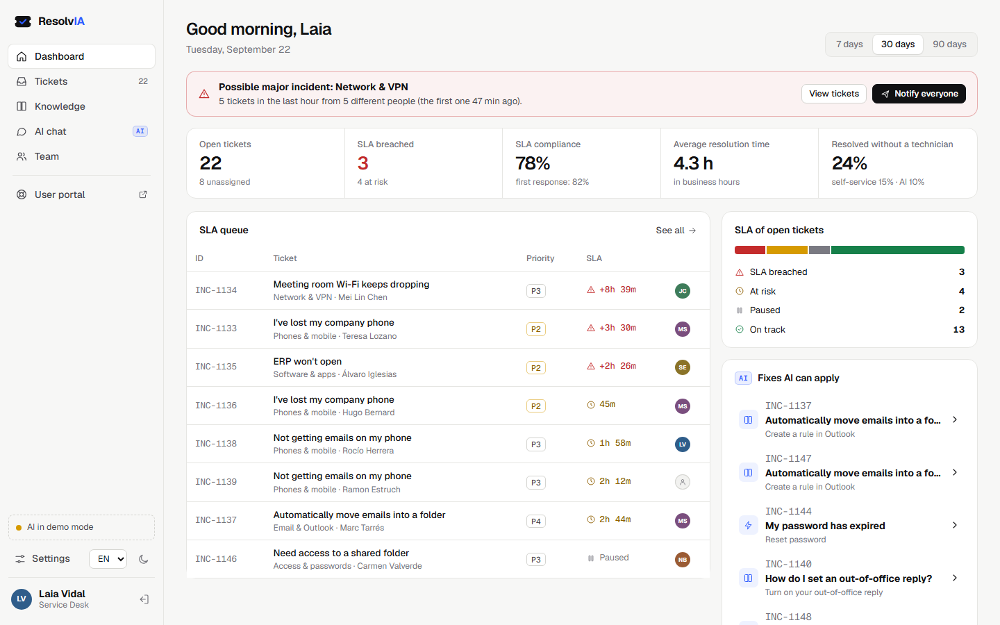
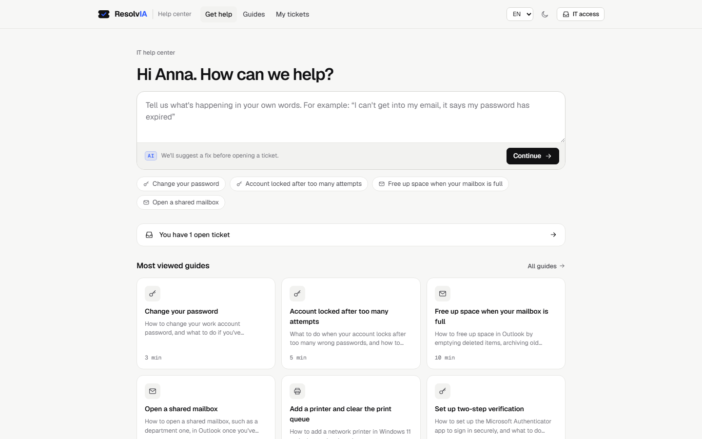
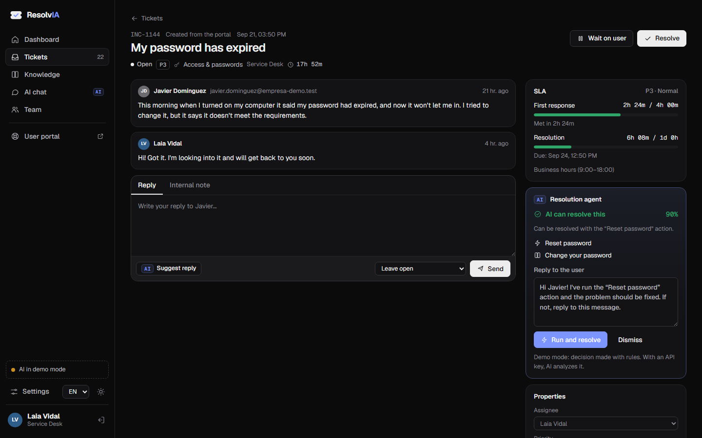
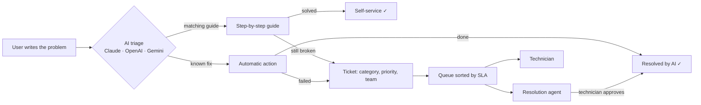

# ResolvIA

**IT ticketing with configurable SLAs and an AI that solves what it can on its own.**

Users describe the problem in their own words. Before a ticket is even opened, ResolvIA suggests the right guide (password changes, Outlook rules, shared mailboxes, printers…) or offers to run an automatic fix. Whatever is left reaches the technicians' console already classified, prioritised and on an SLA clock. The AI then tells the team what comes in most, what takes longest and which open tickets it could close by itself.

It works for IT, but the categories, teams, SLAs and guides all live in one config file, so the same tool fits facilities, HR or any other help desk.

No backend, no build step, no framework: HTML, CSS and vanilla JavaScript modules, hosted for free on GitHub Pages. The AI runs on **Claude, OpenAI or Gemini**, whichever you choose.

**[Live demo](https://querii9.github.io/ResolvIA/)** · works without an API key (demo mode)



---

## Two sides, one app

| User portal | Technician console |
|---|---|
|  |  |
| Describe the problem → get a guide or an automatic fix → open a ticket only if it's still needed. Follow your tickets and reply from the same place. | Queue sorted by SLA, a ticket view with conversation, internal notes and two SLA clocks, the knowledge base, a chat over the tickets and a team page. |

## Features

**For users**
- **Guide first, ticket second.** The request is classified and matched with a step-by-step guide. Steps can be ticked off as you go.
- **Automatic fixes.** When there's an action for it (reset a password, unlock an account, archive a mailbox, grant mailbox access, clear a print queue), the user can run it on the spot.
- **My tickets.** Conversation with the technician, reply, close or reopen.

**For technicians**
- **Configurable SLA.** First response and resolution targets per priority, business hours and days, 24×7 for critical tickets, a risk threshold. The clock pauses while a ticket is waiting on the user.
- **Proactive AI.** It spots open tickets it can solve (the dashboard shows them), explains its plan and drafts the reply. You choose the autonomy: *suggest and a technician approves*, or *resolve on its own when confidence ≥ 80 %*.
- **Suggested replies** in the language the user wrote in, ready to edit, plus an internal note for colleagues.
- **Major incident detection.** Four or more tickets in the same category within an hour raise a banner, with a one-click notice to everyone affected.
- **AI report.** What comes in most, what takes longest to resolve, where the SLA breaks and what to turn into self-service.
- **AI-generated guides.** Turn a solved ticket into a new guide for the knowledge base.
- **Chat with your tickets.** "Which tickets are about to breach?", "What takes longest to resolve?", answered from the live data.
- **Team profiles.** Each technician has a profile (name, team, bio, specialities, colour) with their own stats and activity.

**Everywhere**
- Català · Español · English, light and dark theme, responsive (bottom navigation on mobile).
- Data stays in the browser (localStorage). Import and export as JSON, export tickets as CSV.

## How it works

The rule is simple: **the clock and the numbers are plain code, language is AI.**



- **SLA engine** ([`js/sla.js`](js/sla.js)): counts only business time, skips weekends, pauses while waiting on the user and runs 24×7 for priorities marked that way. Each ticket is `breached`, `risk` (past 75 % of the target), `paused`, `ok` or `met`.
- **Stats** ([`js/stats.js`](js/stats.js)): volume and resolution time per category, daily intake, compliance, self-service and AI rates, per-technician numbers. The AI receives this snapshot already computed, so it reasons about the numbers instead of doing arithmetic.
- **Human in the loop**: by default nothing is changed without a technician's click, and every AI action is logged on the ticket.

## AI providers

Prompts and JSON schemas are shared; each provider has a small adapter in [`js/providers/`](js/providers):

| Provider | Default model | API used | Get a key |
|---|---|---|---|
| **Claude** (Anthropic) | Claude Opus 5 | Messages API · structured outputs · `effort` · refusal fallback | [console.anthropic.com](https://console.anthropic.com/settings/keys) |
| **OpenAI** | GPT-5.6 | Responses API · strict JSON schema · `reasoning.effort` · `store: false` | [platform.openai.com](https://platform.openai.com/api-keys) |
| **Gemini** (Google) | Gemini 3.8 Flash | Interactions API · JSON response format · `thinking_level` · `store: false` | [aistudio.google.com](https://aistudio.google.com/apikey) |

Only the SDK of the provider you use is downloaded, and only when an AI feature runs.

## Demo mode and live AI

A static site can't hide an API key, so ResolvIA has two modes:

- **Demo mode** (default, no key): the SLA engine, stats and data are real. Triage, replies, the report and the chat use rules and templates, and are labelled as such. Anyone can try it.
- **Live mode**: in Settings, pick a provider and paste your own API key. It's stored **only in your browser** and sent straight to that provider through its official SDK. Set a spend limit on the key and don't use it on shared computers.

The demo comes with 6 technicians, 24 requesters, 12 guides and about 150 tickets from the last 45 days, including a VPN outage in progress.

## Automatic actions

The actions in `config.js → automations` are simulated step by step in the demo. Give one a `webhook` URL (Power Automate, n8n, Zapier, your own API…) and it becomes real: ResolvIA sends

```json
{ "action": "reset-password", "ticket": { "id": "INC-1144", "title": "…", "requester": { "name": "…", "email": "…" } } }
```

and treats any `2xx` response as success. Add your own actions with a label and steps per language; the AI will start offering them.

## Run it locally

ES modules need a local server (double-clicking `index.html` won't work):

```bash
python -m http.server 8000
```

Then open <http://localhost:8000>. `npx serve` or VS Code's *Live Server* work too.

## Publish on GitHub Pages

1. Create a repository and push these files.
2. **Settings → Pages → Deploy from a branch → `main` / `(root)`**.
3. A minute later it's live at `https://<your-user>.github.io/<repo>/`.

## Make it yours

Almost everything is in [`js/config.js`](js/config.js):

| Setting | What it does |
|---|---|
| `appName`, `author`, `repoUrl` | Branding and footer links |
| `defaultLanguage` | `"auto"`, `"ca"`, `"es"` or `"en"` |
| `ticketPrefix` | `INC-1001`, `HR-1001`… |
| `teams`, `categories` | Your own teams and categories (each category is routed to a team) |
| `priorities` | Priority levels |
| `sla` | Business hours and days, risk threshold, response and resolution targets per priority, 24×7 |
| `massIncident` | Time window and number of tickets that count as a major incident |
| `automations` | Actions the AI can run, with optional webhooks |
| `ai.provider`, `ai.providers` | Default provider, models, SDK versions |
| `ai.autonomy`, `ai.autoResolveConfidence` | Proactive AI: suggest only, or resolve on its own above a confidence level |
| `ai.effort` | Reasoning effort per feature (`low` / `medium` / `high`) |

- **Guides**: edit them in the app (Knowledge → Manage) or change the built-in ones in [`js/guides-data.js`](js/guides-data.js).
- **Add a language**: copy [`js/lang/en.js`](js/lang/en.js), translate it, then import it and add it to `LANGS` in [`js/i18n.js`](js/i18n.js).
- **Add an AI provider**: create `js/providers/<name>.js` exporting `structured()`, `stream()` and `test()`, then register it in [`js/ai.js`](js/ai.js) and `config.js`.
- **Prompts**: in [`js/ai.js`](js/ai.js), next to the JSON schemas the answers must follow.

## Project structure

```
index.html
css/styles.css           design tokens (light/dark) and layout
js/
  config.js              ← start here
  app.js                 boot, layouts, routing
  store.js               state + localStorage (tickets, users, guides, settings)
  sla.js                 business-time SLA engine (pure functions)
  stats.js               dashboard numbers and major incident detection
  ai.js                  prompts, JSON schemas, live vs demo
  ai-demo.js             demo-mode rules and templates
  ai-errors.js           one error type for every provider
  providers/             anthropic.js · openai.js · gemini.js
  automations.js         automatic actions (simulated or webhook)
  guides-data.js         built-in guides (ca/es/en)
  demo-data.js           demo history generator
  demo-templates.js      demo people and ticket templates
  i18n.js, lang/         translations and formatting
  ui.js, components.js   icons, modals, toasts, shared markup
  views/                 start, portal, dashboard, tickets, ticket, knowledge, chat, team, settings
```

## Ideas for next versions

- E-mail to ticket (a mailbox that opens tickets)
- Shared data for a real team (Supabase or Firebase free tier)
- A small proxy with rate limits so visitors can try live AI without their own key
- Satisfaction survey when a ticket is closed
- Microsoft Teams notifications for breached SLAs

## Català (resum)

**ResolvIA** és una eina de tiquets per a IT amb SLA configurable i una IA que resol el que pot per si sola. L'usuari explica el problema amb les seves paraules i, abans d'obrir cap tiquet, rep la guia adequada (canvi de contrasenya, regles d'Outlook, bústies compartides…) o una acció automàtica. El que queda arriba als tècnics classificat, prioritzat i amb el rellotge d'SLA en marxa. La IA diu què entra més, què triga més a resoldre's i quins tiquets pot tancar ella mateixa. També detecta incidències massives, suggereix respostes, genera guies noves i respon preguntes sobre els tiquets. Funciona amb Claude, OpenAI o Gemini, o sense clau en mode demo. Es pot adaptar a qualsevol àmbit des de `js/config.js`.

## Español (resumen)

**ResolvIA** es una herramienta de tickets para IT con SLA configurable y una IA que resuelve lo que puede por sí sola. El usuario explica el problema con sus palabras y, antes de abrir ningún ticket, recibe la guía adecuada (cambio de contraseña, reglas de Outlook, buzones compartidos…) o una acción automática. Lo que queda llega a los técnicos clasificado, priorizado y con el reloj de SLA en marcha. La IA dice qué entra más, qué tarda más en resolverse y qué tickets puede cerrar ella misma. También detecta incidencias masivas, sugiere respuestas, genera guías nuevas y responde preguntas sobre los tickets. Funciona con Claude, OpenAI o Gemini, o sin clave en modo demo. Se adapta a cualquier ámbito desde `js/config.js`.

## License

[MIT](LICENSE). All people, companies and tickets in the demo are fictional.
